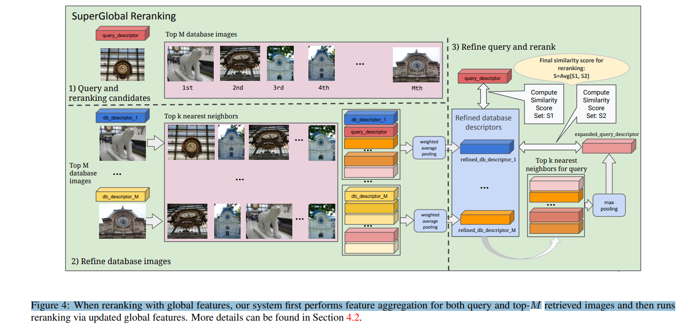
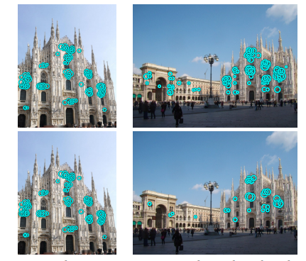
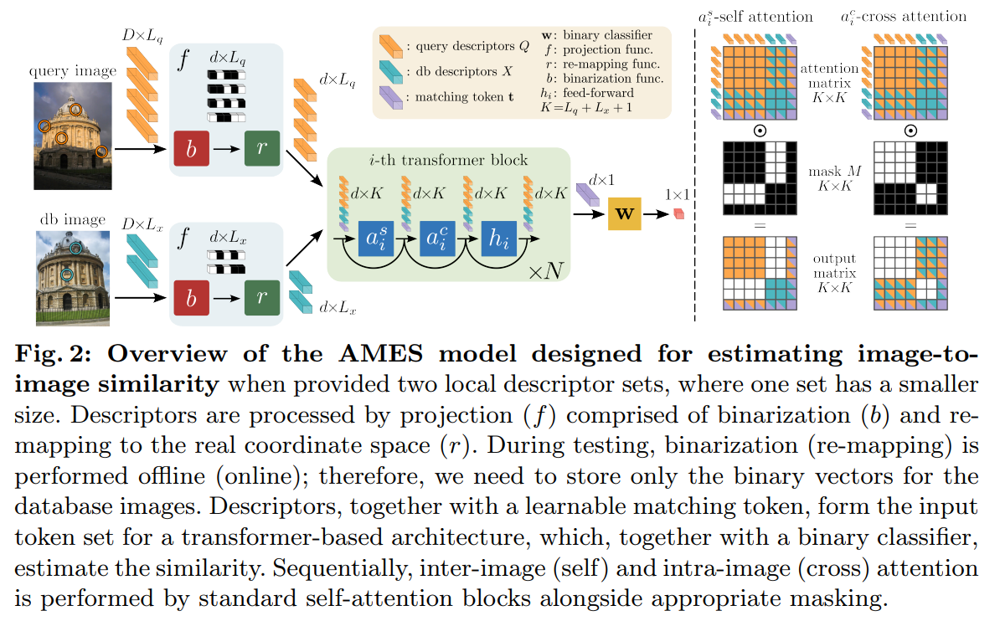

# Visual search

#### Table of Contents

- [Implementation details](#Implementation-details) 
    - [Pipeline overview](#Pipeline-overview)
    - [Models overview](#Models-overview)
    - [Ideas for improvement](#Ideas-for-improvement)
- [Get started](#Get-started)
    - [Env stat](#Env-stat)
    - [Clone repo](#Clone-repo)
    - [Setup env](#Setup-env)
    - [Download data](#Download-data)
    - [Preprocess dataset](#Preprocess-dataset)
    - [Start UI](#Start-UI)
- [Used repos](#Used-repos)


<a name="Implementation-details"/>

## Implementation details

<a name="Pipeline-overview"/>

### Pipeline overview

- Convert data into format of roxford5k dataset: `gen_dataset.py`. Learn more in the original [repo](https://github.com/filipradenovic/revisitop).
- Use model for image retrieval for image search.
- Prepare dataset. Extract features and cache them.
- Use detector to extract ROI from the query image. In our case [Grounding-DINO-1.5-API](https://github.com/IDEA-Research/Grounding-DINO-1.5-API).
- Perform inference of query image:
    - [optional] get text prompt input, what we want to find.
    - Crops ROI by detector and get *n* image crops. Add whole image as *n+1* crop.
    - Find descriptors to our query crops.
    - Find similar images from our test set using cosine similarity.
    - Perform reranking using our model.
    - The most simialr images are top *k=5* images fro each crop.


- In proposed solution, we have option to choose one of 2 image search models. Inference was performed on dataset of 8000 imgs.
    - Model choosen by [paperswithcode image-retrieval](https://paperswithcode.com/task/image-retrieval).

<a name="Models-overview"/>

### Models overview

- [superglobal](https://github.com/shihaoshao-gh/superglobal)
    - Inference time
        - **~18m** generating dataset descriptors
        - does not depend on number of cropped ROIs
        - **8.1s** (for 6 ROI crops)
    - Preprocessed dataset size: 93M
    - Uses one global descriptor for whole images.
    - Image candidates are found by simple cosine similarity. Afterwards reranking is performed.
    
    - Not scale invariant. Building queries in different scales may improve the performance.
    - For more details check the original [paper](https://arxiv.org/pdf/2308.06954).
    

- [ames](https://github.com/pavelsuma/ames)
    - Inference time
        - **~20m** generating dataset descriptors
        - depend on number of cropped ROIs
        - **325.1s** (for 6 ROI crops)
        - ~51s for 1 crop without loading the model
    - Preprocessed dataset size: **22G**

    -There are 2 versions of this model: CVNet and DinoV2 based. I choose CVNet as it is lighter, despite the lack of resources.
    - Uses k~[30-600] local descriptors per image. 
    - The similarity between images is computed via trainable transformer block. In the original work, they use top k=~100 best matches by global similarity superglobal like. In this approach, we calculate the similarity to the whole dataset, which is the reason for such a long inference time.
    
    - For more details check the original [paper](https://arxiv.org/pdf/2408.03282v1).


<a name="Ideas-for-improvement"/>

### Ideas for improvement

- Chosen models were trained to detect the same building (large objects) on 2 images, where the main object is almost on the whole image, which is not our case.
- Define, what we want to find and use it as a prompt for detector. This will improve the performance of ROI detector. If we want our model to search for example clothes, we can add this word to default prompts to our ROI detector.
- We have relatively small dataset (8k images). If we would have more data, the brute-force approach of searching similar images may be too expencive. In this way, we can use other techniques to find similar descriptors. Like k-d trees, or another smart search approach like [faiss](https://github.com/facebookresearch/faiss)
- Time measurements are with loading of models for inference. If we would store the model in the memory whole time the inference time will be lower.

---

<a name="Get-started"/>

## Get started

<a name="Env-stat"/>

### Env stat
- Ubuntu 20.04.4
- CUDA Version: 12.1
- python 3.11

<a name="Clone-repo"/>

### Clone repo

```{bash}
git clone --recurse-submodules -j3 https://github.com/fox-flex/visual_search
```

<a name="Setup-env"/>

### Setup env
```{bash}
conda create --name=visserch python=3.11.5 -y
conda activate visserch
pip install torch==2.4.1 torchvision==0.19.1 torchaudio==2.4.1 --index-url https://download.pytorch.org/whl/cu121
pip install -r requirements.txt
pip install git+https://github.com/IDEA-Research/Grounding-DINO-1.5-API.git
```

<a name="Download-data"/>

### Download data

```{bash}
pip install gdown
chpt_path="ames/chpt"
mkdir "$chpt_path"
cd "$chpt_path"
wget http://ptak.felk.cvut.cz/personal/sumapave/public/ames/networks/CVPR2022_CVNet_R50.pyth
wget http://ptak.felk.cvut.cz/personal/sumapave/public/ames/networks/itq_r101_cvnet_D128.npz
wget http://ptak.felk.cvut.cz/personal/sumapave/public/ames/networks/r101_cvnet_ames.pt
wget http://ptak.felk.cvut.cz/personal/sumapave/public/ames/networks/cvnet_detector.pt
cd -

weights_path="superglobal/weights"
mkdir "$weights_path"
cd "$weights_path"
# https://drive.google.com/drive/folders/1gMbZ8JlTyPlH2-6HW5NHRe58LmKfJybx
gdown 1TNMrFY65ZMre9bWoUvLLKnIYv34h0pLB
cd -
```


<a name="Preprocess-dataset"/>

### Preprocess dataset [optional]

If not performed before setup, the preprocessing will start on first inference.

```{bash}
python gen_dataset.py \
    --in_data_path "data/test_data/" \
    --dataset_name "ds_s" \
    --dataset_dir "data/datasets/" \
    --gen_superglobal \
    --gen_ames \
    --rm_old
```

<a name="Add-GroundingDINO-API-key"/>

### Add GroundingDINO API key [optional]

If you would not add API key, the pipeline will pass full image without ROI cropping as query.

To setup API key:
- Go to [GroundingDINO-API](https://cloud.deepdataspace.com/) website. Register and kreate API-token.
- Place the token into file in `keys` directory.
- When starting UI, pass path to you API key file to the script.


<a name="Start-UI"/>

### Start UI
```{bash}
streamlit run app.py --\
    --dataset_name "ds" \
    --gdino_tocken_path 'keys/gdino_tocken.txt'
```


<a name="Used-repos"/>

## Used repos

- [superglobal](https://github.com/shihaoshao-gh/superglobal)
- [ames](https://github.com/pavelsuma/ames)
- [Grounding-DINO-1.5-API](https://github.com/IDEA-Research/Grounding-DINO-1.5-API)
